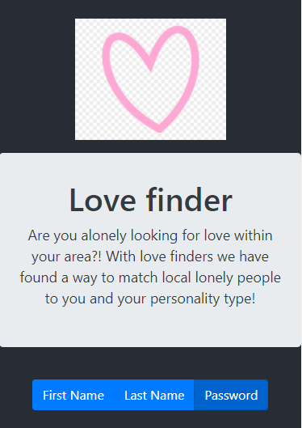

# real-people-near-u
There are really real people near you, here is a list of them brought to you by react.js

[Link to repository](https://github.com/MorgansPlayGames/real-people-near-u)

[Live Website](https://parkers-googlebooks.herokuapp.com/)

1. [ Description. ](#description)
2. [ Technology Used.](#technology-used)
2. [ Installation ](#installation-instructions)
3. [ Usage Information ](#usage-information)
4. [ Contribution Guidelines ](#contribution-guidelines)
5. [ Licence ](#licence)
6. [ Questions ](#questions?)

## Description:
    React wepage that recieves a list of test users in which you can order by first name, last name, or password.

## Technology Used
    JS
    Bootsrtap
    React:
        Axios
    

### Installation Instruction 
    Download
    'npm install' to install dependancies.
    'npm start'
 
### Usage Information
    On run, the webpage can be used to get a list of randomized users and sort them however required.

### Contribution Guidelines
    Fork, update, and
    Submit your code to me!

### Licence 
    Copyright (c) 2020, Parker Morgan
    All rights reserved.
        
    This source code is licensed under the MIT-style license found in the
    LICENSE file in the root directory of this source tree.

### Questions?
    GitHub: MorgansPlayGames
    Email: jpmaster13@msn.com